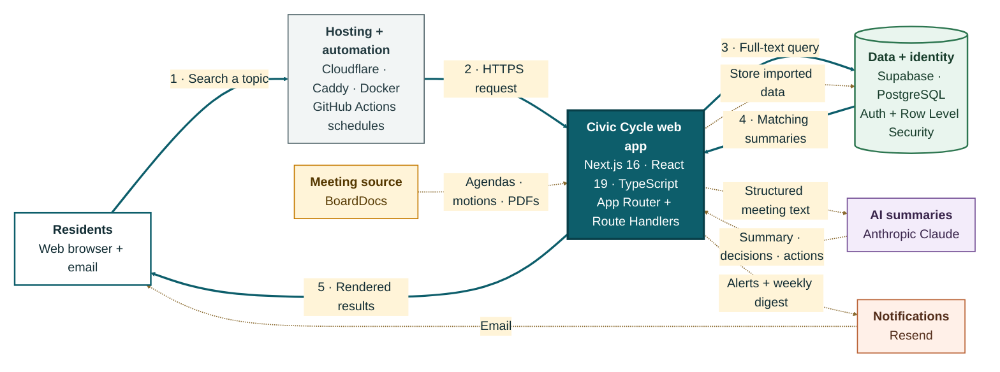

# Civic Cycle architecture

## Components

- **Residents:** Browse public meeting summaries, search topics, manage authenticated alerts, and receive email updates.
- **Hosting + automation:** Cloudflare terminates public HTTPS, Caddy proxies traffic to the read-only Docker container, and GitHub Actions calls protected scheduled endpoints.
- **Civic Cycle web app:** One Next.js application serves the React interface, Server Components, REST-style route handlers, and the core import, search, summarization, alert, and digest logic in `lib/`.
- **Data + identity:** Supabase provides PostgreSQL, full-text search, authentication, and Row Level Security. Server-only jobs use a service-role client for privileged writes.
- **BoardDocs:** Supplies public school-board meeting lists, agendas, official motions and votes, and optional PDF attachments.
- **Anthropic Claude:** Converts parsed meeting text and official motions into structured summaries, key decisions, topics, and action items.
- **Resend:** Delivers keyword-alert and weekly-digest emails, including links back to the relevant Civic Cycle meeting.

## Highlighted feature flow

The numbered teal path shows a resident searching for a topic. The browser request passes through Cloudflare and Caddy to the Next.js app. The app runs PostgreSQL full-text searches across meeting and summary indexes in Supabase, merges the matching meeting IDs, fetches the paginated records, and renders the results back to the resident.

The dashed paths show how that searchable data is prepared: scheduled or admin-triggered jobs fetch BoardDocs content, the application parses it and asks Claude for a structured summary, then stores the source data and summary in Supabase. Separate jobs match saved keywords and send alerts or digests through Resend.
